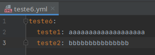

# Spring Boot Microservices with Consul, Spring Cloud Gateway and Docker

Este playground possui 2 microserviços demo Spring Boot Service: deptservice e userservice.
Também possui um app, *gatewayservice*, Spring Cloud Gateway que usa o Consul Service Discovery como gateway
destes microsserviços.

Todas as configurações necessárias para o Service Discovery do Consul estão nos respectivos arquivos
application.properties de cada microserviço e do gateway.

### Gonsul com ssh

Também está incluíndo no docker um script que roda o Gonsul
para pegar arquivos ***.yml .properties etc*** do ***github privado*** com ***ssh*** e *enviar/atualizar* no ***Consul K/V***.

***Configurações para o Gonsul:***

As configurações podem ser alteradas em:

***Gonsul/gonsul.conf***

Neste exemplo, os arquivos que serão enviados para o ***Consul K/V*** estão no repositório privado indicado no parâmetro ***repo-url***.

Será necessário criar seu proprio repositporio privado e informa-lo em ***repo-url***.

Este repositório privado possui a seguinte estrutura e conteúdo:

Os arquivos/diretórios de configuração localizados neste repo serão automaticamente
atualizados no Consul Keys/Values, a cada *60 segundos*, conforme o parâmetro ***poll-interval***.

* Em repo-ssh-key, informe o arquivo de sua chave ssh. O script ja deixará no diretório /.ssh do docker.

* Se ainda não tiver uma chave ssh, é necessário criar uma chave ssh e cadastra-la no github, conforme o link: https://docs.github.com/pt/authentication/connecting-to-github-with-ssh/generating-a-new-ssh-key-and-adding-it-to-the-ssh-agent

* Pode ser que no primeiro uso desta chave o github bloqueie seu uso. Sendo, então, necessário aprovar seu uso em: https://github.com/settings/keys

Após a execução do ***docker-compose***, pode-se verificar no Consul Keys/Values os valores atualizados.

### Usando os K/V do consul

O **userservice** foi atualizado para usar as *Keys/Values* do **Consul**.

Em seu arquivo pom.xml foram adicionados :

***spring-cloud-starter-consul-config***

Para se acessar os valores no K/V do Consul, são necessárias as seguintes configurações:
Além do formato do arquivo (**yaml neste caso**), são necessários três nomes, para fazer uma chave de três níveis no Consul 
***(exigido pelo Spring Cloud)*** e, assim, formar a chave completa de acesso. O ***prefixo*** pode ser o nome do serviço
que, neste caso, é ***user-service***.  ***default-context***, neste caso, é o sub-diretório **config**, e o 
***data-key*** que, neste caso, deve ser o ***nome do arquivo sem sua extenção***.

No Consul, a ***chave*** ficará assim: ***user-service/config/teste6*** e o seu ***value*** será o conteúdo do arquivo:

Caso essa chave de três níveis não fosse definida assim, os valores ***default*** da chave que o Spring Cloud acessaria 
seriam: ***config/application/data***.

Essa chave de ***três níveis*** é uma exigência para que o *Spring Cloud* possa acessar o seu ***value*** através do código:

Ao rodar este sistema, os valores gravados no K/V do Consul poderão ser acessados em:

http://0.0.0.0:8080/user/getConfigFromConsul1

http://0.0.0.0:8080/user/getConfigFromConsul2

Nos links acima são lidos os valores do arquivo *teste6.yml* do repo privado, que foram enviados para o K/V do Consul.

Ao se atualizar o arquivo acima no github, os valores no Consul são automaticamente atualizados pelo ***Gonsul***.

### Instruções gerais de execução:

* Entre em cada subdiretorio, *depservice, gatewayservice, userservice*, e execute o seguinte comando dentro
de cada um:

***mvn package -Dmaven.test.skip***

* Depois, volte ao diretorio raiz *consul-spring-gateway* e execute o seguinte comando:

***docker-compose up -d --build***

* Terminado tudo sem erros, acesse com um browser a página do Consul em:

***http://0.0.0.0:8500***

### Endpoints:

* UserService pelo Gateway:
http://0.0.0.0:8080/user/getUserDetailsById?id=1
* Acesso direto UserService (sem gateway):
http://0.0.0.0:3001/user/getUserDetailsById?id=1

* Acesso do DepartmentService pelo Gateway:
http://0.0.0.0:8080/department/getDepartmentDetailsById?id=1
* Acesso direto DepartmentService (sem gateway):
  http://0.0.0.0:3002/department/getDepartmentDetailsById?id=1

#### Comunicação entre serviços:

* Endpoint do DepartmentService comunicado-se com o UserService pelo Gateway:
http://0.0.0.0:8080/department/getUsersByDeptId?deptId=1

### Referências:

https://blog.devops.dev/spring-boot-microservices-with-consul-spring-cloud-gateway-and-docker-789b624d1d32
https://github.com/indrabasak/spring-consul-example/tree/master/client
https://cloud.spring.io/spring-cloud-static/spring-cloud-consul/2.2.3.RELEASE/reference/html/appendix.html

### Documentação do Gonsul:

https://github.com/miniclip/gonsul/tree/master

