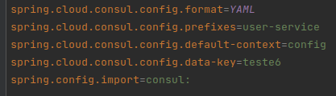
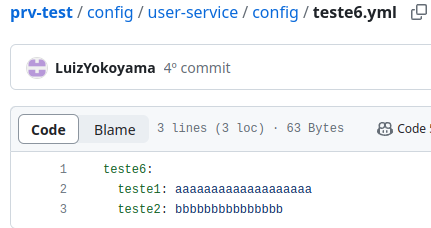

# Adicionando o próprio artifact no  Maven Central Repository

Todas as dependências deste projeto foram adicionadas no Maven Central Repository, bastando apenas referir-se ao artifactId
como na imagem acima.

## Passo a passo realizado para na criação (manuanmente) deste artifact no Maven Central Repository:

#### Criar conta JIRA:

https://issues.sonatype.org/secure/Signup!default.jspa

#### Registrar o próprio artifactID:

https://issues.sonatype.org/secure/CreateIssue.jspa?pid=10134&issuetype=21

Normamente leva 2 dias comerciais para ser aprovado.

### Requisitos mínimos:

#### POM:

O arquivo pom.xml do diretório raiz deste projeto foi usado como package deste novo artifact.

Para isso, as seguintes tags (requisitos obrigatórios) foram adicionadas ao pom.xml do diretório raiz deste projeto:

***packaging = pom***

***licenses***

***developers***

***scm***

#### Upload:

Após os registros, fazer o login em: https://s01.oss.sonatype.org/

Acessar Staging Upload

Preencher o seguinte:

Fazer o upload do arquivo pom.xml:

**É obrigatório criar e enviar os arquivos sha1, md5 e asc, como se segue:**

Primeiro renomeiar o arquivo pom.xml para a sua identificação completa padrão:

*consul-gateway-package-0.0.1.pom*

**A partir dele, criar os demais arquivos:**

Executar: 

sha1sum consul-gateway-package-0.0.1.pom > consul-gateway-package-0.0.1.pom.sha1

md5sum consul-gateway-package-0.0.1.pom > consul-gateway-package-0.0.1.pom.md5

Para a criação do .asc:

Gerar a key-pair, executando:

***gpg --gen-key***

Distribuir como public key, executando:

***gpg --keyserver keyserver.ubuntu.com --send-keys SUA-KEY-GERADA-AQUI***

Verificar: *gpg --keyserver keyserver.ubuntu.com --recv-keys SUA-KEY-GERADA-AQUI*

Se não funcionar, enviar novamente a key.

Por último, assinar o arquivo, executando:

***gpg -ab consul-gateway-package-0.0.1.pom***

#### Agora é só fazer o upload desses 3 arquivos gerados.
Terminado, basta clicar em Upload Artifac:

O artifact será colocado em staging e verificado se cumpre todos os requisitos obrigatórios.
Em caso qualquer erro na verificação, deve ser feito o upload novamente de um novo repositório.

Acessar Staging Repositories:

*Utilizar o botão Refresh para atualizar a lista.* Se estiver tudo certo (pode demorar um pouco a verificação), 
o botão de release será liberado e ao clicar o artifact será publicado e nunca mais poderá ser alterado.

Agora é só referenciar esse artifact como *parent* nos demais pom.xml deste projeto.

### Referências desta parte:

https://maven.apache.org/repository/guide-central-repository-upload.html

https://central.sonatype.org/publish/publish-guide/

https://central.sonatype.org/publish/requirements/gpg/#developer-information

https://central.sonatype.org/publish/requirements/coordinates/

# Spring Boot Microservices with Consul, Spring Cloud Gateway and Docker

Este playground possui 3 microserviços demo Spring Boot Service: deptservice, orgservice e userservice.
Também possui um app, *gatewayservice*, Spring Cloud Gateway que usa o Consul Service Discovery como gateway
destes microsserviços.

Todas as configurações necessárias para o Service Discovery do Consul estão nos respectivos arquivos
application.properties de cada microserviço e do gateway.

### git2consul

Também está incluíndo no docker-compose o um script que roda o git2consul 
para pegar arquivos .yml .properties e .json do github e enviar/atualizar no Consul K/V.

***Configurações para o git2consul:***

As configurações podem ser alteradas em:

*config/git2consul.json*

Neste exemplo, os arquivos que serão enviados para o Consul K/V estão em:

*userservice/src/main/resources/*

Os arquivos/diretórios de configuração localizados neste diretório serão automaticamente
atualizados no Consul Keys/Values.

Após a execução do ***docker-compose***, pode-se verificar no Consul Keys/Values os valores atualizados.

### Usando os K/V do consul

O **userservice** foi atualizado para usar as *Keys/Values* do Consul.

Em seu arquivo pom.xml foram adicionados :

***spring-cloud-starter-bootstrap***

***spring-boot-configuration-processor***

Para usar o bootstrap, o arquivo de configuração application.properties teve que ser alterado para bootstrap.properties
*(também poderia-se usar bootstrap.yml)*. Também é necessário mover os arquivos para um sub-diretório como o ***config*** 
neste caso.

Para se acessar os valores no K/V do Consul, são necessárias as seguintes configurações:
Além do formato do arquivo (**yaml neste caso**), são necessários três nomes, para fazer uma chave de três níveis no Consul 
***(exigido pelo Spring Cloud)*** e, assim, formar a chave completa de acesso. O ***prefixo*** deve ser o nome do repositório 
definido na configuração do git2consul em ***config/git2consul.json***, porque o ***git2consul*** salva os arquivos no 
***K/V do Consul*** com o ***prefixo***
do repositório que, neste caso, é ***user-service***. O ***default-context***, neste caso, é o sub-diretório **config**, e o 
***data-key*** que, neste caso, deve ser o ***nome do arquivo e sua extenção***.

No Consul, a ***chave*** ficará assim: ***user-service/config/teste.yml*** E o seu ***value*** será o conteúdo do arquivo:

Caso essa chave de três níveis não fosse definida assim, os valores ***default*** da chave que o Spring Cloud acessaria 
seriam: ***config/application/data***. Sendo assim, não acessaria os valores gravados pelo ***git2consul***.

Essa chave de ***três níveis*** é uma exigência para que o *Spring Cloud* possa acessar o seu ***value*** através do código:

Ao rodar este sistema, os valores gravados no K/V do Consul poderão ser acessados em:

http://0.0.0.0:8080/user/getConfigFromConsul1

http://0.0.0.0:8080/user/getConfigFromConsul2

Nos links acima são lidos valores de */userservice/src/main/resources/config/teste.yml* que foram enviados para o K/V do Consul.

Ao se atualizar o arquivo acima no github, os valores no Consul são automaticamente atualizados pelo git2consul.

### Instruções gerais de execução:

* Entre em cada subdiretorio, depservice, gatewayservice, orgservice, userservice, e execute o seguinte comando dentro de cada um:

***mvn package -Dmaven.test.skip***

* Depois, volte ao diretorio raiz consul-spring-gateway e execute o seguinte comando:

***docker-compose up -d --build***

* Terminado tudo sem erros, acesse com um browser a página do Consul em:

***http://0.0.0.0:8500***

Deve ser possível ver a seguinte página do Consul:

### Endpoints:

* Acesso do OrganizationService pelo Gateway:
http://0.0.0.0:8080/organization/details

* Acesso direto OrganizationService (sem gateway):
http://0.0.0.0:3003/organization/details

* UserService pelo Gateway:
http://0.0.0.0:8080/user/getUserDetailsById?id=1
* Acesso direto UserService (sem gateway):
http://0.0.0.0:3001/user/getUserDetailsById?id=1

* Acesso do DepartmentService pelo Gateway:
http://0.0.0.0:8080/department/getDepartmentDetailsById?id=1
* Acesso direto DepartmentService (sem gateway):
  http://0.0.0.0:3002/department/getDepartmentDetailsById?id=1

#### Comunicação entre serviços:

* Endpoint do DepartmentService comunicado-se com o UserService pelo Gateway:
http://0.0.0.0:8080/department/getUsersByDeptId?deptId=1

### Referências:

https://maven.apache.org/guides/introduction/introduction-to-the-pom.html#What_is_a_POM
https://blog.devops.dev/spring-boot-microservices-with-consul-spring-cloud-gateway-and-docker-789b624d1d32
https://github.com/indrabasak/spring-consul-example/tree/master/client
https://cloud.spring.io/spring-cloud-static/spring-cloud-consul/2.2.3.RELEASE/reference/html/appendix.html

#### Script de autoria da Jhipster:

https://github.com/jhipster/consul-config-loader